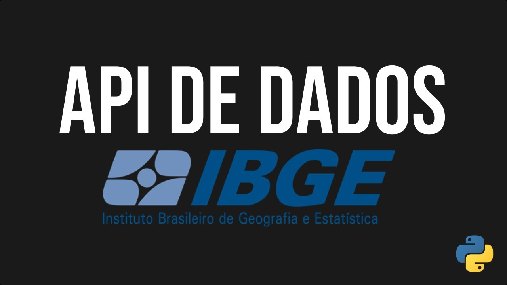
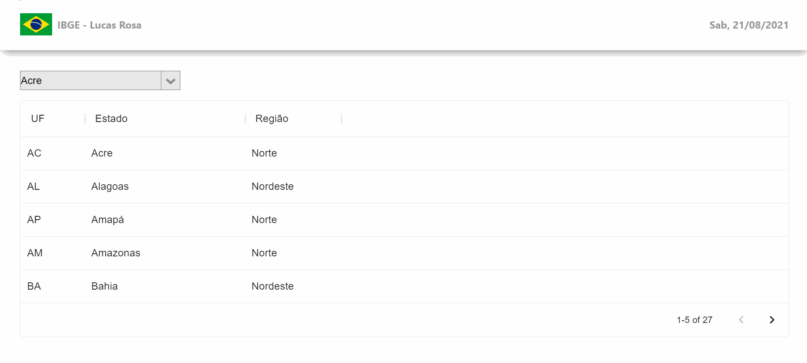

  
  

### - Fui desafiado a fazer uma aplicação que faz requisição à API do IBGE e retorna a lista de estados, municípios e etc.
### - No projeto tive que praticar bastante o Redux, pois foi um requisito do desafio. Os quatro objetos usados no Redux foram:
#### *estados : Que armazena todos os estados do Brasil e o Distrito Federal.
#### *municipioSelecionado: Armazena o código do município selecionado.
#### *municipios: Que armazena todos os municipíos do estado selecionado.
#### *ufSelecionada: Armazena a Unidade Federativa selecionada.

### Fiquei muito satisfeito em fazer este projeto, pois sei que ele me fez crescer profissionalmente :D
### - Nesta aplicação foram usados as seguintes tecnologias:

#### *React JS
#### *Redux
#### *Styled Component
#### *Material UI

### Demonstração da aplicação

### Como visualizar aplicação em sua máquina:

#### 1º Passo: Instale o git, veja o passo a passo em https://git-scm.com/downloads
#### 2º Passo: Instale o node, veja o passo a passo em https://nodejs.org/en/download/
#### 3º Passo: Abra o terminal como administrador e execute o comando: ' git clone https://github.com/lucasmetron/desafioIBGE.git '
#### 4º Passo: Digite o comando ' cd desafioIBGE ' para acessar a pasta do projeto
#### 5º Passo: Digite o comando ' npm install ' e ao finalizar digite o comando ' npm start '

### Gostou do meu projeto!? :D Entre em contato comigo! 
[Linkedin](https://www.linkedin.com/in/lucas-rosa-058683102/)  
[Email: lucasmetron@gmail.com](mailto:lucasmetron@gmail.com)
